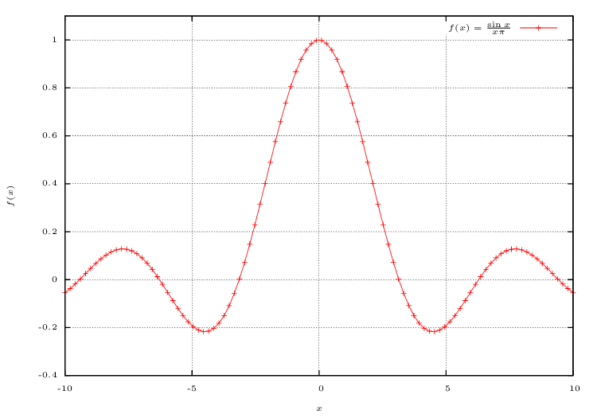

Requirements:
* `GNUplot`
* `pdflatex`
* `evince` (to open .pdf)

After install to plotex nice figures:

~~~
plotex example.plt       
~~~

In current directory will be `example.pdf` with your figure :)

